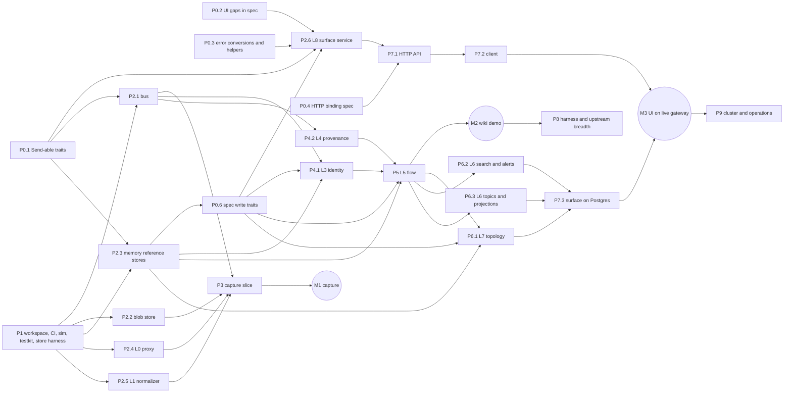

# Crosstalk implementation roadmap

How the gateway gets built from the specification in `spec/`. The spec
(PR #31) is complete:

- the data model and per-layer traits (`spec/types/`);
- 741 invariants (`spec/invariants/`);
- the JSON wire contract with 361 goldens (`docs/features/wire_contract.md`).

The operator UI (PR #23, `ui/`) already runs against the spec's L8 traits
with a synthetic fixture backend.

This document is the plan: phases, work items, deliverables, todo lists and
the dependencies between items. Items with no dependency between them run in
parallel, each on its own branch and worktree.

## Status (2026-10-04)

Work lands on `integration/impl` (item PRs and branches merge there). A
separate staging branch integrates it with the other integration branches;
main is reviewed after the hackathon.

| Item | State |
|---|---|
| P0.1 Send traits, P0.2 UI gaps, P0.4 HTTP binding spec, P0.5 tooling, P0.6 write traits, P0.7 encoding and ids | merged |
| P0.8 channel semantics (UI decision, `docs/channel-semantics`) | in progress |
| P0.9 follow-mode spec and remaining UI gaps (`docs/follow-mode-spec`) | in progress |
| P1.1–P1.5 workspace, checks, sim, testkit, store harness | merged (store tests need `TEST_DATABASE_URL`) |
| P2.1–P2.5 bus, blobs, memory stores, L0 proxy, L1 normalizer | merged |
| P2.6 L8 surface service (`feat/surface-service`) | in progress |
| P3 capture slice (M1) and single-machine deploy (`deploy/`) | merged |
| U world seed (`crosstalk-world`) and L8 conformance suite | UI sessions, in progress |
| P4–P9 | not started |

## Principles

1. **The spec is the only shared boundary.** Every implementation crate
   depends on `crosstalk-spec`, and layer crates never depend on each other.
   - A layer implements the traits its `interfaces/lN_*.rs` module defines.
   - It talks to other layers only through bus events (`events::BusEvent` in
     an `Envelope`) or through spec traits handed to it at wiring time.
   - Composition happens in exactly one place, the gateway binary.

   Two items touching different layers can therefore never need each
   other's code, only the spec. Changing a boundary means a spec PR first.
2. **The invariants are the test plan.** Each invariant's evidence names the
   test that proves it.
   - Evidence marked `agent = "false"` points at `crosstalk_<layer>::...`
     tests that don't exist yet. Writing those tests, then the code, is most
     of each item's todo list.
   - An item is done when its invariants' implementation evidence exists,
     passes, and is marked `agent = "true"`.
3. **Reference models first.** Every stateful store trait gets an in-memory
   implementation (`crosstalk-memory`) before its Postgres one. The in-memory
   version is:
   - the model for the Postgres version's model-based property tests (the
     Hughes "model-based" class in the invariant schema);
   - the backend for early L8 and UI work;
   - the store behind the deterministic simulation tests.
4. **Tests before code.** Write tests first, never weaken a correct test,
   and fix the code, not the test.
5. **Pinned, aged dependencies.** Only well-known crates, released at least a
   week before they're added, pinned with `=`. Versions shared with the UI
   (tokio 1.53.1, serde 1.0.229, serde_json 1.0.151, thiserror 2.0.21,
   tracing 0.1.44, tracing-subscriber 0.3.23, jiff 0.2.37, hyper 1.11.1)
   stay identical to the UI's.

## Workspace layout (target)

```text
Cargo.toml                 virtual workspace; members spec + crates/*; excludes ui
spec/                      crosstalk-spec: types, invariants, wire goldens (exists)
crates/
  sim/                     crosstalk-sim: virtual clock, seeded RNG, fault injection, DST driver
  testkit/                 crosstalk-testkit: value builders, recorded-traffic corpus, fake upstreams
  memory/                  crosstalk-memory: in-memory reference impls of every store trait
  store/                   crosstalk-store: Postgres pool, per-layer schema migrations, test DB harness
  transport/               crosstalk-transport (L2): in-process bus, blob store, dead letters; NATS later
  ingress/                 crosstalk-ingress (L0): reverse/forward proxy, routing, tee, framers
  canonical/               crosstalk-canonical (L1): per-protocol normalizers
  reconstruct/             crosstalk-reconstruct (L3): identity, merges, claims, threading
  provenance/              crosstalk-provenance (L4): segmenter, decoders, fingerprints, matching
  flow/                    crosstalk-flow (L5): resources, channels, correlator, verdicts
  analysis/                crosstalk-analysis (L6): embeddings, topics, search, rules, triage, projections
  topology/                crosstalk-topology (L7): edge buckets, graphs, series, watermark, retention
  surface/                 crosstalk-surface (L8): QueryApi, OperatorActions, LiveFeed, export over spec traits
  api/                     crosstalk-api: HTTP + SSE server for the L8 surface (wire contract)
  client/                  crosstalk-client: implements the L8 traits over HTTP (for the UI)
  gateway/                 crosstalk-gateway: the `crosstalk` binary; config, wiring, process roles
ui/                        crosstalk-ui (separate package and lock; links surface or client)
```

The dependency rule, enforced by a test that reads `cargo metadata`:
- layer crates (`ingress` through `surface`) may depend on `spec`, `store`,
  `transport`'s trait-free utilities, and third-party crates;
- `memory`, `sim` and `testkit` are dev-dependencies of the layer crates;
- only `gateway`, `api` and `client` may depend on layer crates.

## Phase overview and dependencies



| Item | Depends on | Can run in parallel with |
| --- | --- | --- |
| P0.1–P0.5 spec follow-ups | — | P1, each other |
| P1 workspace and infrastructure | — | P0 |
| P2.1 L2 bus and dead letters | P1, P0.1 | P2.2–P2.6 |
| P2.2 blob store | P1 | P2.1, P2.3–P2.6 |
| P2.3 in-memory reference stores | P1, P0.1 | P2.1, P2.2, P2.4, P2.5 |
| P2.4 L0 proxy (Anthropic, HTTP and SSE) | P1 | P2.1–P2.3, P2.5, P2.6 |
| P2.5 L1 normalizer (Anthropic Messages) | P1 | P2.1–P2.4, P2.6 |
| P0.6 spec write traits | P2.3 | P2.4, P2.5, P3 |
| P2.6 L8 surface over spec traits | P0.1–P0.3, P0.6, P2.3 | P2.1, P2.2, P2.4, P2.5, P3–P6 |
| P3 capture slice, **M1** | P2.1, P2.2, P2.4, P2.5 | P2.6, P4 |
| P4.1 L3 identity and threading | P2.1, P2.3, P0.6 | P4.2, P3 |
| P4.2 L4 provenance | P2.1 | P4.1, P3 |
| P5 L5 flow, **M2** | P4.1, P4.2, P2.3, P0.6 | P2.6, P7.1 |
| P6.1 L7 topology | P5 events (spec), P2.3 | P6.2, P6.3 |
| P6.2 L6 search and alerts | P5 | P6.1, P6.3 |
| P6.3 L6 topics and projections | P5, open decision D1 | P6.1, P6.2 |
| P7.1 HTTP API server | P0.4, P2.6 | P3–P6 |
| P7.2 HTTP client for the UI | P7.1 | P6 |
| P7.3 surface on Postgres stores, **M3** | P6.*, P7.2 | P8 |
| P8 breadth (Codex, OpenAI-compatible, pi, forward proxy) | M2 | P7, P9 |
| P9 cluster and operations | M3 | P8 |
| U (UI track, owned by the UI agent) | P0.1–P0.3, then P2.6, then P7.2 | everything |

Milestones:
- **M1 capture:** Claude Code's traffic flows through crosstalk unchanged and
  every generation exchange is stored.
- **M2 wiki demo:** two Claude Code agents share a wiki, crosstalk discovers
  the channel and confirms the transmission.
- **M3 UI on live gateway:** the operator UI runs against the real gateway
  instead of its fixture.

---

## P0 Spec follow-ups

Small spec PRs that unblock implementation and close the gaps the UI hit.
Each is a normal spec change: tests, invariants, goldens and docs.

### P0.1 Send-able async traits
The spec's traits use native `async fn` with no `Send` bound. The UI only
compiles because its backend is one concrete type, and a tokio-hosted
implementation needs `Send` futures anyway.

**Deliverable:** every async trait in `interfaces/` (L0–L8) declares its
methods as `fn ...(...) -> impl Future<Output = ...> + Send`, and its
associated streams (`LiveFeed::Stream`, `ExportStream`, `Subscription`) as
`Send + 'static`.

- [ ] Convert every async trait method; implementations keep writing `async fn`.
- [ ] Bound the associated stream types `Send + 'static`.
- [ ] Add a compile test that every trait's future is `Send`, using a dummy implementation.
- [ ] Docs: `type_spec.md` conventions.

### P0.2 UI gaps that need a spec answer
**Deliverable:** the UI's two remaining stand-in traits (`Present`,
`ExportFormats` in `ui/src/contract/`) become spec API.

- [ ] Add `QueryApi::present(&Caller) -> Result<Present, QueryError>` with `Present { now, bucket_width, export_formats, current_rule_version, default_remap_threshold, frame_retention }`. Write its golden and invariants: `now` is the gateway's wall clock, and `bucket_width` equals L7's `EdgeStore::bucket_width`.
- [ ] Add `InputError::UnsupportedFormat` for an export format the gateway doesn't offer.
- [ ] Add `QueryApi::alert_rule(id)`.
- [ ] `SearchMode: Default`; a length bound on semantic rule text.
- [ ] `MergedInto` carries the merge's time and author, or `AgentDetail` exposes them through its merge records. Pick one.
- [ ] Add a channel column to `ProjectionFrame`'s point categories, so the UI stops calling `transmissions_by_id` once per point.
- [ ] Rewrite the stale "What replaces the UI's stand-ins" section in `wire_contract.md`.

### P0.3 Error conversions and helpers
**Deliverable:** every L5–L8 error the UI maps by hand has one `From` impl
in `query_errors.rs`.

- [ ] Add `From<PinError>`, `From<CatalogError>` and `From<VerdictError>` for `ActionError`, and the full `RegistryError` mapping.
- [ ] Add `AlertState::kind()` and `is_active()`, so the UI's `alert_state.rs` can be deleted.
- [ ] Give `ConfigChange` variants for sinks and retention.
- [ ] Make `TopologyGraph` fully checked (private fields, built through `new`). It was deferred from the wire contract.

### P0.4 HTTP binding of the L8 surface
The wire contract fixes the JSON, and this item fixes the HTTP around it.

**Deliverable:** `docs/features/http_api.md`, invariants, and a route table
type in the spec (`interfaces/l8_surface/http.rs`), so the server and the
client are both checked against one definition.

- [ ] One route per `QueryApi` method and per `ActionRequest`: method, path, where each argument goes (path, query string or JSON body), and the success status.
- [ ] Status mapping for every `QueryError` and `ActionError` variant. Start from the UI's mapping (`ui/src/data/errors.rs`): 400, 403, 404, 409, 422 and 500.
- [ ] Authentication: a bearer token or session cookie becomes a `RequestIdentity`, then `OperatorDirectory::caller`. Never from the body (INV-371).
- [ ] SSE endpoint: the framing from `wire/surface_actions.md`, with `Last-Event-ID` resume.
- [ ] Projection: `GET .../projections/{id}` returns `ProjectionInfo` JSON, and `.../frame` returns the `application/octet-stream` frame with caching rules.
- [ ] Export: a streaming JSONL download using `ExportLine` framing, plus `Content-Disposition`.
- [ ] Goldens for the route table, and invariants for auth, the status mapping and SSE resume.

### P0.5 Repository tooling
- [ ] Move the invariant validator into the repository as `scripts/inv_check.py`.
- [ ] Fix `rust-toolchain.toml` (`"miri "` has a trailing space).

### P0.6 Spec write traits
Building the in-memory reference stores (P2.3) showed that the spec's store traits are mostly read-and-decide. Nothing creates agents, discovered channels, resources, accesses or transmissions, and L6 and L7 have no write side for topic fits, assignments or edge activation. The user decided the write side becomes spec traits. Memory and Postgres stores then implement the same traits, and the model-based harnesses drive any store through the spec alone.

**Deliverable:** per-layer write traits in `interfaces/l3`–`l8`, plus the missing reads and error variants:
- channel get-by-id and listing;
- a frame that doesn't match its job;
- resolving an alert that isn't acknowledged.

It also needs:
- one convention for time arguments;
- one owner for publishing `TopicVersionDropped`;
- `crosstalk-memory` converted to implement the new traits, with its private seeding traits removed and its duplicated helpers unified.

Depends on P2.3, and P2.6 and the P4–P6 Postgres stores depend on it.

### P0.7 Shared encoding and ids
The canonical message encoding and hash, media blobs, `NormalizedExchange`,
the deployment secret and keyed hasher (with rotation overlap ends), and ULID
minting at a given time, moved into the spec because several layers must
compute them identically. See `docs/features/spec_primitives.md`.

### P0.8 Channel semantics
The user's decision, from the UI track: a discovered channel exists only once
a transmission between different agents goes through a resource; suspected
channels are listed as `Unconfirmed`; declarations without traffic stay
declarations; channels whose only traffic is between later-merged agents are
hidden at read time. Ported from the UI branch onto the current spec
(INV-850..869), with `ChannelRow::discovered_at` as the listing order and the
memory stores updated.

### P0.9 Follow mode and remaining UI gaps
`QueryApi::now` and `bucket_width`, `Changed::Traffic`, traffic-caused
channel listing changes, `DataRevision` on `Watermarked`, projection
extensions, the default remap threshold, and the gap list from the UI's
migration onto the wave-3 types (INV-870..899). P2.6 and the UI's follow mode
depend on it.

---

## P1 Workspace and infrastructure

Blocks everything in P2 and later. One branch, done before the per-layer
work starts.

### P1.1 Workspace
**Deliverable:** a virtual workspace that builds, with every crate in the
layout above present as an empty library.

- [ ] Root `Cargo.toml` becomes `[workspace]` with members `spec` and `crates/*`, and `exclude = ["ui"]`. The placeholder `crosstalk` package and its `src/main.rs` move to `crates/gateway`, whose binary is still named `crosstalk`.
- [ ] Replace `spec/Cargo.lock` with the root lock. Update the spec manifest's description, which says it is not part of the build.
- [ ] Put the shared pins in `[workspace.dependencies]`, set lints in `[workspace.lints]`, and use edition 2024.
- [ ] Rewrite invariant evidence paths: `crosstalk::<layer>::` becomes `crosstalk_<layer>::`, covering the 9 prefixes and 805 paths.
- [ ] Add the architecture test that enforces the dependency rule.

### P1.2 Checks
- [ ] `scripts/check.sh` runs fmt, clippy (`-D warnings`), test, doc (`-D warnings`) and `inv_check` across the workspace.
- [ ] Extend `inv_check` to verify that every `crosstalk_<layer>::...` evidence path names a crate that exists. Paths marked `agent = "true"` must resolve to a test that exists, found by grep.

### P1.3 `crosstalk-sim`
**Deliverable:** deterministic simulation (DST) for every
`requires = ["dst"]` invariant.

- [ ] A virtual clock, behind a `Clock` trait in the spec or the crate, and a seeded RNG.
- [ ] Fault injection for the bus (delay, reorder, duplicate, drop and redeliver), the store (fail and latency) and upstreams.
- [ ] A driver that replays a scenario and a seed. A failure prints its seed, and re-running with that seed reproduces it.
- [ ] Decide between tokio paused time plus our own fault layer, and turmoil (decision D4).

### P1.4 `crosstalk-testkit`
- [ ] Builders for common spec values, such as an agent, a channel, an exchange or a confirmed transmission.
- [ ] A recorded-traffic corpus: real Claude Code request and response pairs (HTTP and SSE), redacted, stored as files with a loader.
- [ ] A fake upstream: a hyper server that replays corpus responses, including SSE streaming and error statuses.

### P1.5 `crosstalk-store`
- [ ] A Postgres pool, with config read from the environment (`DATABASE_URL`).
- [ ] Per-layer schemas: each layer crate owns `crates/<layer>/migrations` in its own Postgres schema with its own migrations table, so layers never conflict on migration numbers.
- [ ] A test harness: `TEST_DATABASE_URL` and a fresh schema per test. Required extensions: `pgvector` and `pg_trgm`; TimescaleDB is optional (decision D3).
- [ ] Choose the SQL library (decision D2, sqlx proposed).

---

## P2 Foundations (parallel)

### P2.1 L2 transport: in-process bus
Implements `EventBus`, `Subscription`, `RetryPolicy` and `DeadLetterStore`
from `l2_transport.rs`.

**Deliverable:** an in-process bus with consumer groups, ack/nack, retries
with backoff, and dead letters after the retry budget. It is used by the
single-node gateway and by the simulation.

- [ ] Implement the transport invariants (INV-100–138) and their implementation evidence, including at-least-once delivery, per-subject ordering, dead letters and replay.
- [ ] Undecodable events are nacked, then dead-lettered (the strict wire decision).
- [ ] Run DST tests under the bus fault injection.

### P2.2 Blob store
- [ ] `BlobStore` on the filesystem (content-addressed by BLAKE3, written atomically) and in memory.
- [ ] Get on a dropped body returns `None` (content retention).

### P2.3 `crosstalk-memory`: reference stores
**Deliverable:** an in-memory implementation of every stateful trait:
- `AgentDirectory`, `ClaimStore`, `ActivityStore`, `AgentReads` (L3);
- `FingerprintIndex` (L4);
- `ChannelRegistry`, `ChannelDirectory` and the verdict store (L5);
- `AlertRuleStore`, `AlertTriage`, `TopicCatalog`, `ProjectionStore` and the search index (L6);
- `EdgeStore` (L7);
- the audit log and `OperatorDirectory` (L8).

- [ ] Each implementation's unit tests come from the invariants that name it: domain, postcondition and representation.
- [ ] Export a model-based property harness: given a store implementation and the reference, random operation sequences must give equal observable results. The Postgres implementations reuse it.

### P2.4 L0 ingress: reverse proxy for Anthropic
Implements `UpstreamRouter`, `ClientIdentifier`, `ProviderAdapter`,
`ResponseFramer` and the SSE tee from `l0_ingress.rs`, on hyper.

**Deliverable:** Claude Code with `ANTHROPIC_BASE_URL` pointed at crosstalk
works exactly as without it, and each generation exchange produces a
`RawExchange` on an in-process channel.

- [ ] Route to the upstream from the configured routes, and hash the credential (never stored raw).
- [ ] Classify the endpoint: only `Generation` is captured; token counting and model listing are forwarded but not captured.
- [ ] Forward before decoding: the body decodes concurrently, off the hot path, and a failed decode still forwards.
- [ ] Tee the SSE response without buffering the client stream, and choose the framer from the response head.
- [ ] Bench the added p99 latency against the performance invariants, and hold that budget in CI.
- [ ] Implement the ingress invariants (INV-1–46) and their implementation evidence.

### P2.5 L1 canonical: Anthropic Messages normalizer
Implements `Normalizer` from `l1_canonical.rs`, as pure functions.

**Deliverable:** `RawExchange` to `NormalizedExchange` for the Anthropic
Messages protocol, including streaming reassembly, tool calls and results,
system prompts and cache-control blocks.

- [ ] Golden tests over the testkit corpus.
- [ ] Message bodies go to the blob store, and the exchange carries hashes.
- [ ] Implement the canonical invariants (INV-47–99) and their implementation evidence.

### P2.6 L8 surface over spec traits
Implements `QueryApi`, `OperatorActions`, `LiveFeed` and export in
`crosstalk-surface`, generic over the L3–L7 store traits. Tests run on the
`crosstalk-memory` stores.

**Deliverable:** a surface service the UI can link in place of its fixture,
with the same seeded world loaded into the memory stores.

- [ ] Permissions per method, `Watermarked` reads, paging and cursors, and the typed error mapping.
- [ ] `ActionRequest::into_action`, then `act`, then the audit record, inverting exactly (`AuditOutcome`).
- [ ] The live feed: an epoch and sequence cursor, resync, heartbeat and `end`.
- [ ] Export: plan, stream, seal and trailer, plus the audit record.
- [ ] Implement the surface invariants (INV-362–383, 393–513, and the wave-2 and gap-list-3 ranges) and their implementation evidence.
- [ ] Port the UI fixture's world generator into `testkit`, so the UI and the gateway share one synthetic world.

---

## P3 Capture slice (milestone M1)

**Deliverable:** the `crosstalk` binary in single-node mode. Proxy, then
normalize, then publish `ExchangeCaptured` on the in-process bus, then
persist exchanges and blobs.

- [ ] Gateway config as JSON, with secrets referenced by environment variable names.
- [ ] Wiring: L0 hands off to L1 in-process, and L1 publishes to the bus.
- [ ] An end-to-end test: a fake Claude Code client, through the gateway, to the fake upstream, with the exchange stored.
- [ ] A manual check with a real Claude Code session.
- [ ] Structured logs (key-value) and a health endpoint.

## P4 Identity and provenance (parallel)

Both consume bus events, so they can be developed against recorded event
streams from testkit without waiting for P3.

### P4.1 L3 reconstruction
- [ ] `IdentityResolver`: identity evidence scoped to credential and account; harness claims are never evidence.
- [ ] `AgentDirectory` on Postgres: merges, unmerge restoring `prior`, vetoes and the merge log. It is model-tested against `crosstalk-memory`.
- [ ] `Threader`: conversations, including WebSocket increment resolution.
- [ ] Implement INV-139–190 and the merge and claim invariants.

### P4.2 L4 provenance
- [ ] `Segmenter`, the `Decoder`s (codecs and carriers), and `Fingerprinter` (winnowing).
- [ ] `FingerprintIndex` on Postgres (or an in-memory shard).
- [ ] Publish `ContentMatched`. The semantic matcher is a stub until P6.2 provides embeddings.
- [ ] Implement INV-191–235.

## P5 L5 flow (milestone M2)

- [ ] `ResourceExtractor`: tool calls to accesses, for files, HTTP, and the wiki and MCP tools.
- [ ] `ChannelRegistry` on Postgres: declare, discover, promote and supersede, policy history, and correlator shards keyed by canonical channel (INV-253).
- [ ] `Correlator`: co-access plus content match gives a transmission. Includes suspected, confirmed, expiry and late confirmation on a canonical channel.
- [ ] Verdict store.
- [ ] Implement INV-236–290 plus the promotion and verdict ranges.
- [ ] **M2 demo script:** two Claude Code agents and a local wiki MCP server, through the gateway. Assert the discovered channel and the confirmed transmission.

## P6 Insight (parallel)

### P6.1 L7 topology
- [ ] `EdgeStore` on Postgres: buckets per topic version, the watermark, activation, retention and pins.
- [ ] Graph, series, channel topology, totals and agent traffic.
- [ ] Model-tested against memory. Implement INV-331–361 plus the watermark and retention ranges.

### P6.2 L6 search and alerts
- [ ] `Embedder` against an OpenAI-compatible embeddings endpoint (decision D1).
- [ ] `SearchIndex` on pgvector plus pg_trgm.
- [ ] Alert rule evaluation and triage on the rule store.
- [ ] Sinks.

### P6.3 L6 topics and projections
- [ ] `TopicModel` fitting and versions, with lineage.
- [ ] `ProjectionStore`, plus a `LayoutFitter` (UMAP) that is seeded and deterministic.
- [ ] Implementation language is decision D1.

## P7 Surface on the real system (milestone M3)

### P7.1 HTTP API server
- [ ] `crosstalk-api`: the P0.4 route table over `crosstalk-surface`.
- [ ] Request extractors through `wire::decode_request`; auth to `Caller`; SSE; frame and export streaming.
- [ ] Conformance tests: every route against the spec's route table and goldens.

### P7.2 HTTP client
- [ ] `crosstalk-client` implements `QueryApi`, `OperatorActions` and `LiveFeed` over HTTP, so the UI's backend can switch to it without page changes.
- [ ] Round-trip tests: client to server to memory stores.

### P7.3 Surface on Postgres
- [ ] Wire the surface to the Postgres stores in the gateway.
- [ ] An end-to-end test: the wiki demo traffic, then the API, showing the graph, evidence and alert.

## P8 Harness and upstream breadth (after M2)
- [ ] Codex: the Responses API over HTTP and WebSocket (`Continuation::Increment`).
- [ ] OpenAI-compatible chat completions: vLLM, SGLang and lab APIs.
- [ ] pi and oh-my-pi.
- [ ] A forward proxy with TLS interception for allowlisted hosts only, for OAuth subscription backends (Claude Pro/Max, ChatGPT/Codex, Copilot, Gemini Code Assist).
- [ ] Each one is a corpus plus a normalizer plus framer tests. The ingress invariants are re-run per protocol.

## P9 Cluster and operations (after M3)
- [ ] A NATS JetStream `EventBus` adapter that passes the same conformance and DST suites as the in-process bus.
- [ ] Process roles (proxy nodes, consumers, API) and coordinated upgrades, since the wire format is strict.
- [ ] Retention jobs, metrics and dashboards, load tests, and container and compose deployment.

## U: UI track (owned by the UI agent)
1. Port `feat/ui` to the integrated spec:
   - name lookups are `BTreeMap`;
   - `CallerSnapshot`;
   - `InvalidReversal`;
   - `aggregates/alert/`;
   - `Finite`.
   
   Resolve PR #23's `docs/OVERVIEW.md` conflict.
2. After P0.1–P0.3: delete `ui/src/contract/` (`Present`, `ExportFormats`) and `backend/alert_state.rs`.
3. After P2.6: add `AppBackend::Gateway` linking `crosstalk-surface` over the shared synthetic world.
4. After P7.2: add `AppBackend::Remote` over `crosstalk-client`. Send `ActionRequest`, and adopt the spec's SSE and JSONL framing wherever the browser-facing formats can match it.

## Open decisions
- **D1: topic modeling, UMAP and embeddings.** Implement clustering
  (HDBSCAN plus c-TF-IDF) and UMAP in Rust, or run them in a Python sidecar
  behind the `TopicModel` and `LayoutFitter` traits. Embeddings come from an
  OpenAI-compatible endpoint either way; the choice is which model and who
  hosts it. Proposed: start with a sidecar behind the traits, and keep
  determinism (seeds) in the contract.
- **D2: SQL access.** Decided: sqlx.
- **D3: time-series storage.** Decided: plain Postgres with partitioned
  bucket tables. The deployment runs plain Postgres 18 (pgvector, pg_trgm),
  no TimescaleDB.
- **D4: simulation.** Decided: tokio paused time plus our own fault layer.
- **D5: HTTP server.** axum over the UI's hyper version (proposed), or hyper
  directly for the API too. The proxy uses hyper directly either way.
